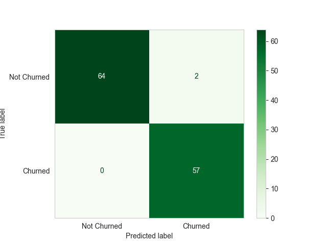
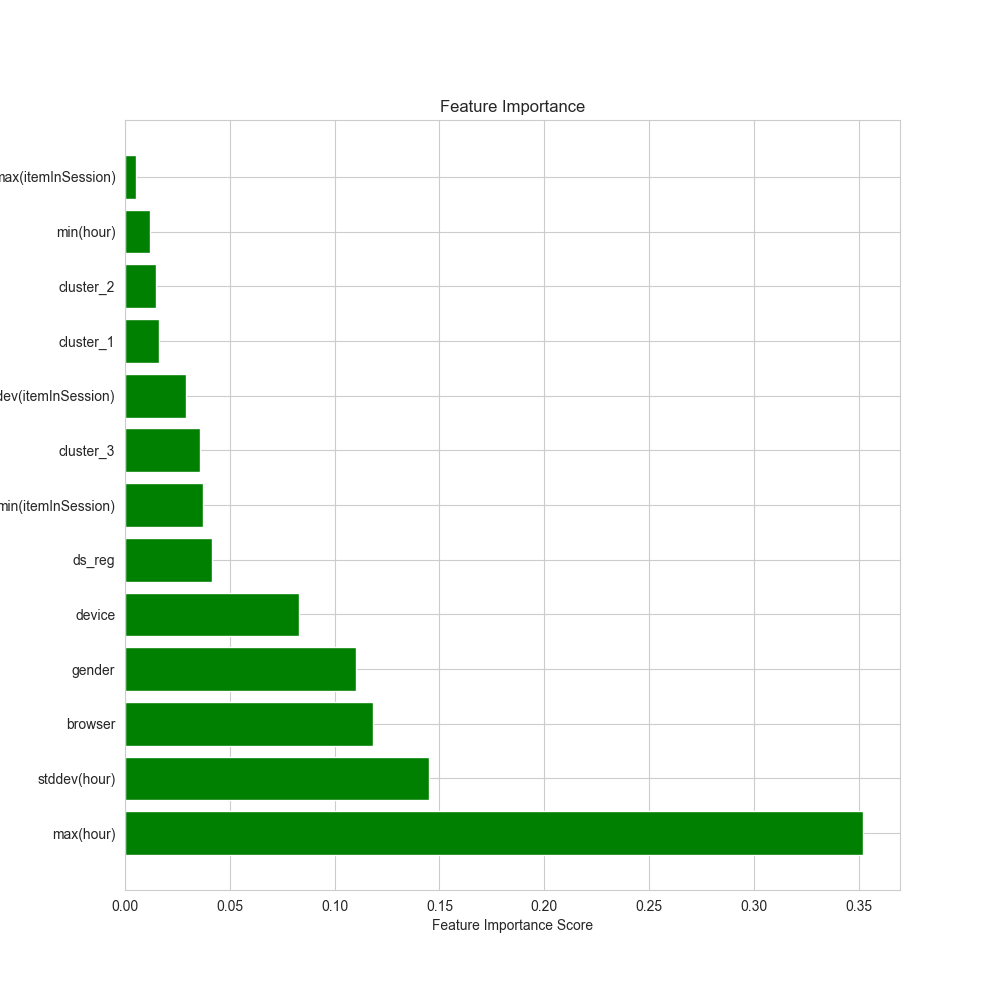
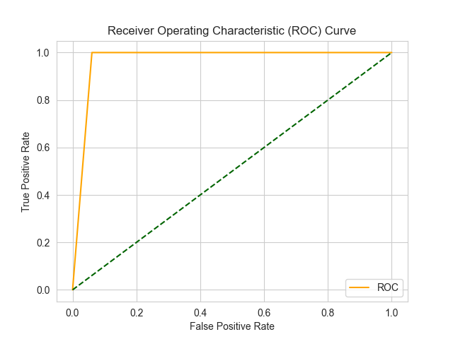

# Predict Customer Churn With PySpark

## Table of Contents

- [Predict Customer Churn With PySpark](#predict-customer-churn-with-pyspark)
  - [Table of Contents](#table-of-contents)
  - [ Overview](#-overview)
  - [ Installations](#-installations)
  - [ Data](#-data)
  - [ Methodology](#-methodology)
  - [ Results](#-results)
  - [ Conclusion \& Acknowledgements](#-conclusion--acknowledgements)

## <a name="overview"></a> Overview

This projects aims to predict customer churn with PySpark based on the dataset provided by Udacity. 

The two main goals of this project are as follows:
1) Exploring the relationgship between the variables in the user log and their churning behavior.
2) Provide a model that can predict the churning behavior of the users.

<br>

>>The associated medium article can be found here
[here](https://medium.com/@keremtuberkapraz/predicting-customer-churn-using-pyspark-f9705f5592cf)

<br>
The project is built on `PySpark` and `pandas`. The data is loaded into `Spark` and then, the data is processed together with `pandas`. For certain operations `numpy` library is used. The data is then visualized with `matplotlib` and `seaborn`.

The model is built with `pySpark ML` and `imbalanced-learn`. The model is then evaluated with `pySpark ML` and `sklearn`.

The project is divided into 3 parts. The first part is the ETL, where in order to create extra features I make connection to musicbrainz API. The second part is the data exploration and feature preprocessing and the third part is the model building & evaluation.


The diagram above shows the general structure of the project

In the diagram above, the `light blue` boxes represent data. The `purple` boxes represent the ipynb and python files that can both consume and output data files. 

The lines indicate the flow.
An `incoming arrow` indicates that the file consumes the data. An `outgoing arrow` indicates that the file outputs the data.

The `pink`cloud shaped boxes represent tha fact that associated actions are performed on the AWS cloud


project structure:

```
├── README.md
├── EDA.ipynb
├── predicting.ipynb
├── requirements.txt
├── data
│   ├── artist_info_sample.csv
│   └── final_df_processed.json
│   └── final_df.csv
│   └── final_df.json
│   └── genres.csv
│   └── mini_sparkify_event_data.json
├── etl
│   ├── clustering.ipynb
│   ├── get_artist_info.py
│   ├── get_genres.py
├── img

```

In order to reach the goals, the following libraries are used:

## <a name="installations"></a> Installations

- `Python 3.8+`
- `pyspark`
- `pandas`
- `numpy`
- `matplotlib`
- `seaborn`
- `sklearn`
- `imbalanced-learn`

## <a name="data"></a> Data

The dataset is provided by `Udacity`. I have read it somewhere that it is a subset of the [Million Song Dataset](http://millionsongdataset.com/). I checked the mentioned dataset briefly for receiving extra information about the songs etc. But then, I thought getting information from that data would be some kind of cheating. So, I decided to stick with the data provided by `Udacity` and find my own way to get the information I need.

For this reason, additionally to the data provided, I used musicbrainz API to get the most common genres of the artists. 

The dataset consists of 286500 rows and 18 columns. The columns are as follows:

Column | Description
--- | ---
**artist** | name of the artist
**auth** | authentication status of the user
**firstName** | first name of the user
**gender** | gender of the user
**ItemInSession** | IMO, the number of items in a particular session
**lastName** | last name of the user
**length** | length of each session by the user
**level** | subscription type of the user. Can be free or paid
**location** | location data of the user.
**method** | method of accessing the app. Can be GET or PUT
**page** | the page the user is on in the app
**registration** | registration timestamp of the user
**SessionId** | ID of the session
**song** | name of the song
**status** | HTML status code to the event
**ts** | the timestamp indicating when the logged activity took place
**userAgent** | classic metadata about the user's device, browser, etc.
**userId** | auto generated ID of the user to mark them uniquely


## <a name = "Methodology"></a> Methodology 
Besides the columns above, many other features were created which can be seen in the notebook. Yet, the two extra features I created are as follows:

Column | Description
--- | ---
**Churn** | 1 if the user has churned, 0 otherwise
**Cluster** | First, achieved most common genres of the artists. Then, clustered the artist genres into 3 clusters using PCA and KMeans.

In order to make the prediction model work there were two potential paths that I could take:
1) Make a model on the raw data -user logs. This meant that no aggregation would be done on the data. The model would be trained on the raw data to predict the `cancellation confirmation`events. I purposefully avoided this for two reasons. First, I am not sure if the model would be able to predict the `cancellation confirmation` events by taking into account of the `sequentiality of the rows`. Because machine learning models would treat rows as interchangeable units rather than sequential units unless it's a time series model.Second, eventhough this challenge is designed to measure my ability to cope with big-data, when combined with the first reason, I thought it would be a bit redundant to work with user logs unless the sequentiality problem that I mentioned above is addressed. Also, without adressing sequentiality, certain rows would indeed create `data leakage` .
2) Make a model on the aggregated data. This meant that I would aggregate the data by the user and then, make a model to predict the `churn` column. This means that my model is aiming to `predict the user profile that is more likely to churn`. Not, churning event itself. This is the path I took.

For this reason I first made aggregation of the logs by the user. The aggregation created the user profiles.

In order to prevent the potential data leage I wanted to play safe. So for this reason I excluded the `cancellation confirmation` events from the data as well as `Downgrade`, `Submit Downgrade` and `Cancel` events. Logically these events seem complementary to the `churn` column. So, I thought it would be better to exclude them from the data.


## <a name = "results"></a> Results 

I tested several models. The best model was the `Random Forest` model. The other models are `logistic regression`, `Linear SVC`. 

My first model showed me that the imbalanced nature of the data was a problem. There were 225 unique users and 5 of them were churners. So, I decided to use `imbalanced-learn` to balance the data. I used `SMOTE` oversampler to balance the data.

After balancing, ss results seemed satisfactory, I decided to stick with the `Random Forest` model.
The results are as follows:

The model has %97 F1 score on the test set. The confusion matrix is as follows:

For logistic regression model I also explored grid search, which made the model perform better, yet nowhere near the `Random Forest` model.

**`confusion matrix`**


The confusion matrix shows that the model successfully predicts the churners. Among `57 churners`, model predicted `each of them correctly`. The model also predicts the non-churners correctly. Among `56 non-churners`, model predicted `62 of them correctly`. Only markde 4 of them as churners which was a mistake.

Overall I am happy with the way model performed. As I used user profiles based on aggregated usage logs, the model doesn't seem like leaking.


The feature importance is as follows:

**`Feature Importance`**


According to the model, the most important parameter is `max(hour)` the latest time that the users used the app. Following that, `stdev(hour)` is the second most important parameter. The spread of the usage behaviour seems like an important factor. In model's eyes, `browser` is an important determinant of churn. `gender`, `device` `ds_reg` - days since registration, `cluster_3` - cluster of genre of artists and `min(itemInSession` are other important parameters.


**`ROC Curve`**


I am not big fan of ROC curves. I think they are not very informative. Yet, I included it here for the sake of completeness. The ROC curve shows that the model is performing well. The area under the curve is 0.97 which is a good score. Also, the curve is close to the top left corner which means that the model is performing well.


## <a name = "conclusion"></a> Conclusion & Acknowledgements

As concluding remarks, first of all I would like to mention briefly my personal experience with the project. 

I am really satisfied that I have used `EMR-Clusters` for the first time in my life. Knowing that under the hood I was commanding several computers at the same time in a different geography was unique feeling. 

In terms of evaluating the problem statement I declared on top of the file, 

1) Model performance is satisfactory. This model can be extended to predict the churners on the fly. I can imagine deploying this model for the production. In a live setting, since the logs of usage would change everyday, the aggregated user profiles would also reflect the changes. So, the model would be able to predict the churners on the fly.
2) In terms of understanding the relationship between churn and user log variables, I believe we have reached a good point in producing an empirically backed information. The parameters I explained in the results section would be discussed with the stakeholders. The stakeholders would be able to make decisions based on the information.


>Limitations of the project: <br> <br>
 My approach to the problem in as `making API calls and merging the in local computer` is not in line with the sprit of working with big-data. The mini-sparkify data fits to the memory of my local device but working with full dataset would make this impossible. The reason I made the API calls locally is that it takes time and for a non-commercial project like this, I didn't want to make everything on the cloud. I wanted to make the API calls locally and then, upload the data to the cloud. This is not the way to work with big-data. I am aware of this. Yet, I wanted to make the API calls locally for the sake of time. I admit that this is not the way to work with big-data. Yet, I wanted to make the API calls locally for the sake of costs <br><br> Another approach would have been making the calls locally and uploading the results to the S3 and making the work there. I admit that this would be my choice for sure. Yet, since this `genre clustering` was just an experimental idea, I wanted to perform everything locally to make sure that this idea is helpful. Since, now I know that it works, I can refactor the code so that everything can be done on the cloud.<br><br> 
 Another limitation is that I relied on `SMOTE oversampler`, in general it's good, yet the SMOTE creates artificial data based on the observed ones. So, when working with small datasets, the results should always be taken with a grain of salt. <br><br>
 `Overfitting:` So far only measure that I used to prevent overfitting was `cross-validation`. I didn't use any other measure. Cross-validation is a tool to keep model in check. However, it doesn't guarantee that the model is not overfitting. The reason is, generalization from the data is not only about the data at hand. If we use bayesian terminology a bit, data at hand is just an output of an underlying `data generating mechanism`. Given the sample, the model is doing good. But can't say anything about representativeness of our data at hand with regards to the all other potential variations that the data generating mechanism can produce.<br><br>
 So, for better generalizations we need to understand the data generating mechanism. This implies causal ML domain and I have no expertise on that matter. 
  <br><br>
 


