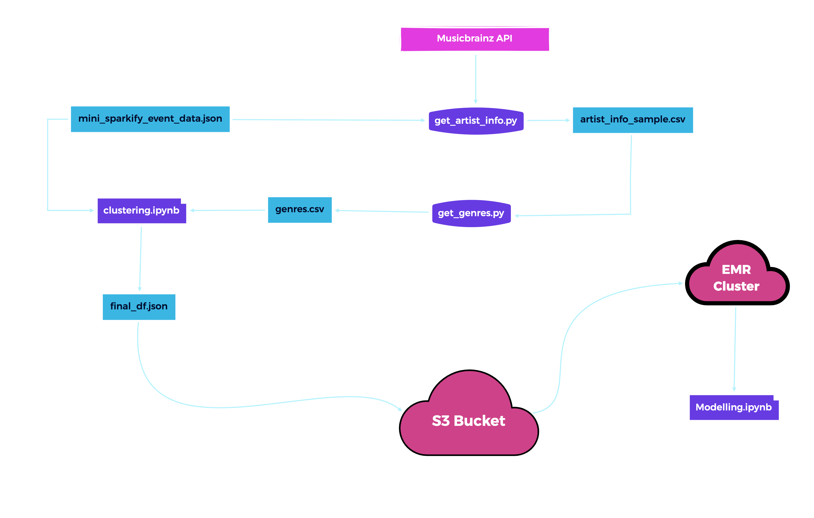
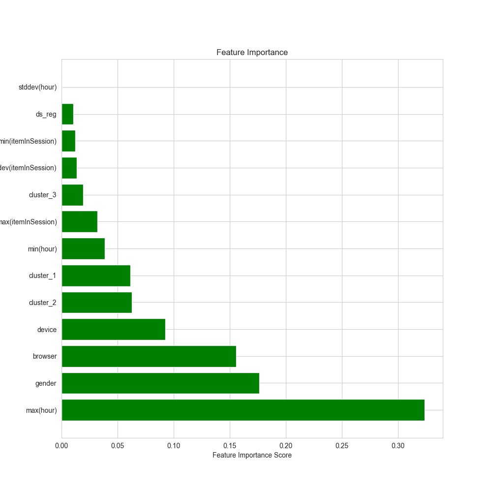
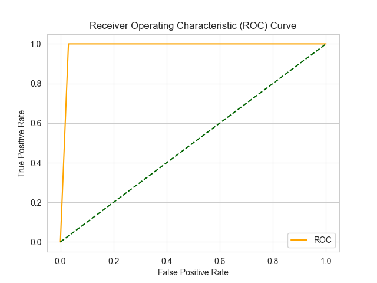

# Predict Customer Churn With PySpark

## Table of Contents

- [Predict Customer Churn With PySpark](#predict-customer-churn-with-pyspark)
  - [Table of Contents](#table-of-contents)
  - [ Overview](#-overview)
  - [ Installations](#-installations)
  - [ Data](#-data)
  - [ Results](#-results)
  - [ Conclusion \& Acknowledgements](#-conclusion--acknowledgements)

##  Overview

##  Installations

- `Python 3.8+`
- `pyspark`
- `pandas`
- `numpy`
- `matplotlib`
- `seaborn`
- `sklearn`
- `imbalanced-learn`

##  Data

##  Results 

The model has %97 F1 score on the test set. The confusion matrix is as follows:

**`confusion matrix`**

The feature importance is as follows:

**`Feature Importance`**

**`ROC Curve`**

##  Conclusion & Acknowledgements

